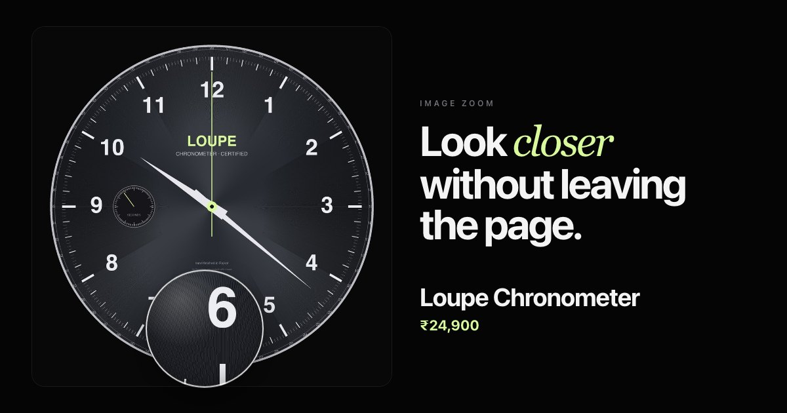

# Loupe

Image zoom for product pages. A **lens glides after your pointer**, an
**inside mode** magnifies the whole frame where you point, and on touch you
can **pinch, pan and double-tap**.

**[→ Live demo](https://yagnikbarasiya23.github.io/loupe-image-zoom/)**



Zero dependencies. About 15 kB of JavaScript, 4.7 kB gzipped, plus 0.7 kB of CSS.

## What it does

- **Lens mode.** A round lens appears exactly under the cursor and then
  follows it on a spring, so quick movements feel smooth rather than jittery.
  It shows the high-resolution file, not an upscaled thumbnail.
- **Inside mode.** The picture itself magnifies inside its frame, with the
  spot under the pointer staying under the pointer.
- **Touch.** Pinch to zoom around your fingers, drag to pan once zoomed,
  double-tap to zoom in or back out. When the image isn't zoomed, a
  one-finger drag still scrolls the page.
- **Keyboard.** <kbd>Enter</kbd> zooms at the centre, arrow keys move,
  <kbd>+</kbd>/<kbd>−</kbd> change magnification, <kbd>Esc</kbd> closes.
- **Large files are warmed up early.** The high-resolution source is decoded in the
  background as soon as you mount or swap an image.

## Run it

You need [Node.js](https://nodejs.org) 20.19 or newer.

```bash
git clone https://github.com/YagnikBarasiya23/loupe-image-zoom.git
cd loupe-image-zoom
npm install
npm run dev
```

Open the URL it prints — usually <http://localhost:5173>.

```bash
npm test          # unit tests for the zoom and gesture maths
npm run build     # → dist/
npm run preview   # serve what you just built
```

The watch dial and textile in the demo are generated for this project, so the
fine detail is real and free to reuse.

## What's in here

| File | What it does |
| --- | --- |
| `loupe.js` | The component: lens and inside transforms, springs, pointer, touch and keyboard handling |
| `loupe.css` | Lens glass, clipping and touch behaviour |
| `index.html`, `style.css`, `app.js` | The demo page |
| `public/images/` | Demo images at 1000 px (display) and 2400 px (zoom) |
| `test/loupe.test.js` | Tests for the lens mapping, inside zoom, pan limits and pinch |

Only `loupe.js` and `loupe.css` are needed in your project.

## How it works

**The lens is a window onto a scaled copy.** Inside the lens is a second
`` using the high-resolution source, laid out at the same size as the
visible picture and then scaled by the zoom factor from its top-left corner.
`lensTransform()` shifts it so the image point under the pointer lands at the
lens centre: `inner = r − point × zoom`. Changing magnification only changes
a scale in the transform, never the layout.

**Inside zoom keeps the pointer fixed.** Scaling the visible image by `z` from
its top-left and translating by `point × (1 − z)` leaves the pointed-at pixel
where it was — and the image edges line up with the frame edges when you
point at them, so no background ever shows.

**One spring for everything.** Position, magnification, lens visibility and
touch pan/scale are springs with shared stiffness and damping. The pointer
only sets targets. The lens pops in slightly faster than it moves, and
magnification eases slightly slower, so changes are easy to follow.

**Pinch without drift.** A two-finger gesture records the pan, scale,
midpoint and finger distance when it starts. `pinch()` scales by the change
in distance and positions the image so the content that was under the
starting midpoint is under the current midpoint — zooming and panning in the
same motion. On release the scale settles back into range and `clampPan()`
makes sure no edge of the frame is left uncovered.

Only `transform` and `opacity` animate.

## Accessibility

- The frame is focusable, labelled with the image's `alt` text and
  instructions, and announces the zoom level through a polite live region.
- Zooming is fully keyboard operable in both modes.
- The magnified copy is decorative (`alt=""`, `aria-hidden`); the original
  image keeps its `alt`.
- Scroll-wheel zoom is **off by default** so the page never traps scrolling.
- `prefers-reduced-motion: reduce` jumps straight to each position.

## Browser support

Current Chrome, Edge, Firefox and Safari. Uses Pointer Events and
`ResizeObserver`.

## Using it in your own project

Copy `loupe.js` and `loupe.css`, then wrap your image:

```html
<link rel="stylesheet" href="loupe.css">

<div id="viewer" data-zoom-src="watch-2400.jpg">
  
</div>

<script type="module">
  import Loupe from './loupe.js';
  const viewer = new Loupe(document.querySelector('#viewer'), { zoom: 3 });

  // Gallery thumbnails:
  viewer.setImage('strap-1000.jpg', 'strap-2400.jpg', 'Leather strap');
</script>
```

The image should fill the wrapper's width. For sharp magnification, give
`data-zoom-src` (or the `src` option) a file at least `zoom` times the
displayed size.

### Options

| Option | Default | |
| --- | --- | --- |
| `mode` | `'lens'` | `'lens'` or `'inside'` |
| `zoom` | `2.5` | Starting magnification |
| `min`, `max` | `1.5`, `6` | Magnification limits |
| `size` | `180` | Lens diameter in px |
| `src` | `data-zoom-src` | High-resolution file |
| `wheel` | `false` | Let the scroll wheel change magnification while zoomed |
| `stiffness` | `320` | Spring stiffness |
| `damping` | `30` | Spring damping |

### Methods and events

| | |
| --- | --- |
| `setImage(src, zoomSrc, alt)` | Swap the picture |
| `setZoom(zoom)` | Change magnification |
| `configure(options)` | Change any option, including `mode` and `size` |
| `destroy()` | Remove the lens and listeners |
| `loupe:zoom` | Fires on the wrapper with `{ zoom }` |

Style the lens with `--loupe-ring` and `--loupe-shadow` on `.loupe`.

## Licence

[MIT](LICENSE) © 2026 Yagnik Barasiya. Use it in personal and client work.

More components at [yagnikbarasiya.com/components](https://www.yagnikbarasiya.com/components).
